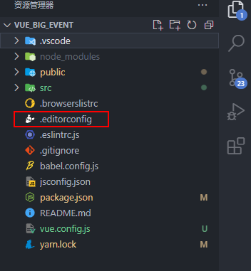
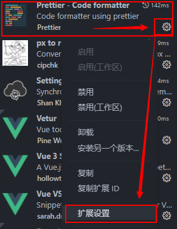
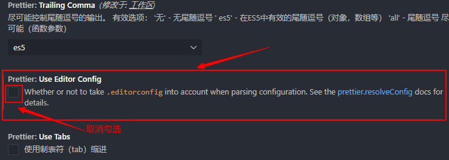
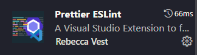

# DebugFragment
## ESlint+Prettier各项配置冲突的语法报错
1.解决修改了<code>Prettier</code>默认配置，项目内格式化无法生效<br>
2.解决<code>Prettier</code>缺少配置，<code>函数名</code>和<code>括号</code>之间，自动添加空格<br>
3.<code>settings.json</code>配置项分享
一个程序员，可能非常精通写代码，但是平时很少接触的配置项，会让他更加焦头烂额，复制这些配置项，减少不比必要的痛苦，留更多的精力在代码开发上，附心脏骤停和复苏对比图。

### 1.修改Prettier默认配置,格式化无法生效
在VUE项目根目录，不创建".prettierrc.js"文件的前提下，只通过插件——扩展设置，或settings.json进行配置后，刚刚修改的配置，格式化效果未生效
### 解决方法：
1.1由于prettier插件优先使用项目根目录下的editorconfig配置文件，所以在vscode中怎么配置有没有用

#### 1.2进入perttier插件扩展配置

#### 1.3取消Use Editor Config的复选框，这样就不会优先使用editorconfig配置文件了

### 2.Prettier缺少配置，函数名和后面的括号之间加个空格
问题描述：
ESlint的默认standard 规则要求函数名和括号之间有一个空格，这就是space-before-function-paren 规则（ESLint 本身也会默认开启这个规则）。 但是 prettier 完全没有这个规则！prettier 不会处理这个空格的问题，所以根据 ESLint 配置修改 prettier 规则不可行
#### 2.1安装 prettier-eslint插件

### 3.settings.json配置项分享
```json
{
  // 选择vue文件的格式化工具
  "[vue]": {
    // 1.使用prettier,无法配置函数名后的空格
    // "editor.defaultFormatter": "esbenp.prettier-vscode"
    // 2.使用prettier-eslint
    "editor.defaultFormatter": "rvest.vs-code-prettier-eslint"
  },
  // #每次保存的时候自动格式化
  "editor.formatOnSave": true,
  // 自动修复
  "editor.codeActionsOnSave": {
    "source.fixAll.eslint": true
  },
  "eslint.enable": true, //是否开启vscode的eslint
  // 配置 ESLint 检查的文件类型
  "eslint.validate": ["javascript", "vue", "html"],
  "eslint.options": {
    //指定vscode的eslint所处理的文件的后缀
    "extensions": [".js", ".vue", ".ts", ".tsx"]
  },
  //  #去掉代码结尾的分号
  "prettier.semi": false,
  //  #使用单引号替代双引号
  "prettier.singleQuote": true,
  "prettier.trailingComma": "none",
  "prettier.bracketSpacing": true,
  //  #让函数(名)和后面的括号之间加个空格
  "javascript.format.insertSpaceBeforeFunctionParenthesis": true,
  // #让vue中的js按编辑器自带的ts格式进行格式化
  "vetur.format.defaultFormatter.js": "prettier-eslint",
  "git.enableSmartCommit": true,
  "editor.quickSuggestions": {
    "strings": true
  },
  //一定要在vutur.defaultFormatterOptions参数中设置，单独修改prettier扩展的设置是无法解决这个问题的，因为perttier默认忽略了vue文件（事实上从忽略列表移除vue也不能解决这个问题）
  "vetur.format.defaultFormatterOptions": {
    "prettier": {
      "semi": false, // 格式化不加分号
      "singleQuote": true // 格式化以单引号为主
    },
    "js-beautify-html": {
      // force-aligned | force-expand-multiline
      "wrap_attributes": "force-aligned"
    },
    "prettyhtml": {
      "printWidth": 100,
      "singleQuote": false,
      "wrapAttributes": false,
      "sortAttributes": true
    }
  },
  // 关于@src目录路径提示的配置
  // 安装vscode插件 `Path Intellisense`
  "path-intellisense.mappings": {
    "@": "${workspaceRoot}/src"
  }
}
```
## error ‘XXXXX‘ is not defined no-undef
在使用vue的时候，使用一个全局变量，ESLint的语法会出现ESLint: 'Aliplayer' is not defined. (no-undef)，说变量未定义，这时我们可以添加配置，取消这个校验。在.eslintrc.js文件中添加一个配置，位置如下图所示，我的全局变量就是Aliplayer
```js
  "globals":{
    "Aliplayer": true
  }
  ```
  ```js
  'globals': {
    'ElMessage': true,
  },
  ```