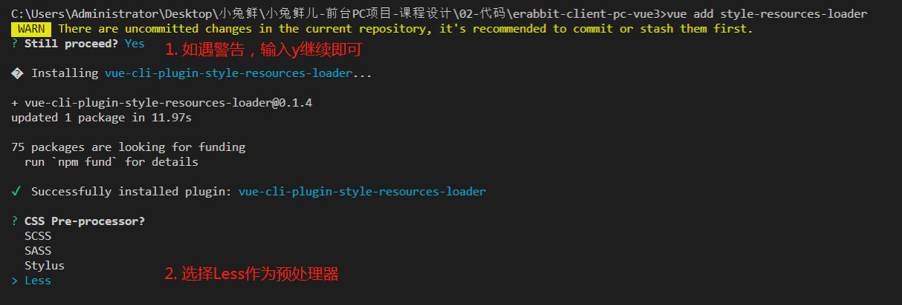

## vue持久化
* 在开发的过程中，像用户信息（名字，头像，token）需要vuex中存储且需要本地存储。
* 再例如，购物车如果需要未登录状态下也支持，如果管理在vuex中页需要存储在本地。
* 我们需要category模块存储分类信息，但是分类信息不需要持久化。
```sh
npm i vuex-persistedstate
```
```js
import { createStore } from 'vuex'
+import createPersistedstate from 'vuex-persistedstate'

import user from './modules/user'
import cart from './modules/cart'
import cart from './modules/category'

export default createStore({
  modules: {
    user,
    cart,
    category
  },
+  plugins: [
+    createPersistedstate({
+      key: 'erabbit-client-pc-store',
+      paths: ['user', 'cart']
+    })
+  ]
})
```
注意：

===> 默认是存储在localStorage中

===> key是存储数据的键名

===> paths是存储state中的那些数据，如果是模块下具体的数据需要加上模块名称，如user.token

===> 修改state后触发才可以看到本地存储数据的的变化。

测试： user模块定义一个mutation在main.js去调用下，观察浏览器application的localStorage下数据。

## less的自动化导入
```sh
vue add style-resources-loader
```

* 安装完毕后会在<code>vue.config.js</code>中自动添加配置，如下：
```js
module.exports = {
  pluginOptions: {
    'style-resources-loader': {
      preProcessor: 'less',
      patterns: []
    }
  }
}
```
* 把你需要注入的文件配置一下后，重启服务即可。
```js
+const path = require('path')
module.exports = {
  pluginOptions: {
    'style-resources-loader': {
      preProcessor: 'less',
      patterns: [
+        path.join(__dirname, './src/assets/styles/variables.less'),
+        path.join(__dirname, './src/assets/styles/mixins.less')
      ]
    }
  }
}
```